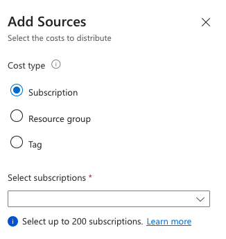

## Introduction

## What is Cost allocation

In large enterprises, Azure services are often managed centrally but used by various departments. The central team usually wants to redistribute the cost of these shared services to the departments using them. This is where cost allocation in Azure's Cost Management comes in.

Cost allocation allows you to reassign the costs of shared services from one subscription, resource group, or tag to another within your organization. It's a way to shift the financial responsibility of shared services to the departments or business units that consume them, enhancing cost accountability.

However, it's important to note that cost allocation doesn't support purchases like reservations and savings plans. Also, it doesn't affect your billing invoice or change billing responsibilities. Its primary function is to facilitate internal chargebacks, showing costs as they are reassigned or distributed.

The allocated costs are visible in cost analysis, appearing as other items associated with the targeted subscriptions, resource groups, or tags specified in your cost allocation rule.

Reference: [Microsoft learn](https://learn.microsoft.com/en-us/azure/cost-management-billing/costs/allocate-costs)

## How to implement it

### Selecting your source

to select which costs should be allocated you have 3 options:

- Tags
- Resource Groups
- Subscriptions

Keep in mind if you choose Tags, even if you tag all the resources in a subscriptions, it is possible some costs will stay in the source subscription
like Defender for Cloud. When tags are used all the resources in your tenant with this tag will be selected.

### Selecting the destination

You have the same 3 options as destination, where tag is the strange one here.
I have not tested this one yet, but it looks weird to allocate cost to a tag.

### Distribute the selected costs

## Usecases

### Shared AKS

If you use a shared AKS cluster it is possible that you have multiple teams working on different nodepools with different sku's.
If thats the case you want to allocate the costs of that specific nodepool to the right team.

### Azure Firewall

When you have an Hub/spoke network model in Azure, you will most likely have a central firewall in place where te traffic of your spoke is
going through. Cost allocation makes it possible to rearrange the cost of the subscription of the firewall to all the spokes.

## Limitations

- You cannot order the rules. the rules are executed in creation order.
- There is a function to allocate costs with propotional to network or compute cost, but this function is only available in the portal and not with the API.
- Target subscriptions is limited to 200. This means if you have a lot of spokes you should consider only allocate to production subscriptions.

## References

- [Microsoft learn](https://learn.microsoft.com/en-us/azure/cost-management-billing/costs/allocate-costs)
- [Rest API](https://learn.microsoft.com/en-us/rest/api/cost-management/cost-allocation-rules?view=rest-cost-management-2023-11-01)
